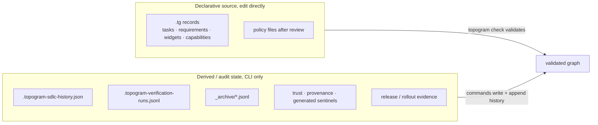
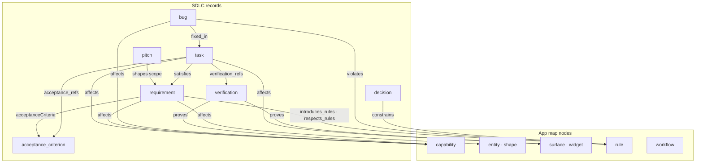
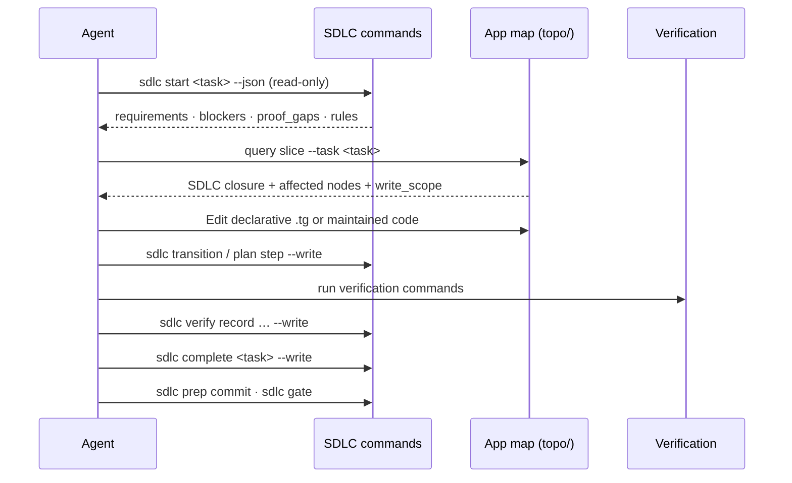

# How Topogram Manages SDLC

> SDLC records live in the app map; stateful changes go through the CLI.

Status: current
Audience: maintainers, product owners, agents, and technical writers
Use when: you need to understand Topogram SDLC philosophy, command-owned state, and how graph nodes connect to work and proof.
Read time: ~3 minutes

Topogram is not a project manager bolted onto a generator. When a project adopts
SDLC, **work records live in `topo/`** beside entities, capabilities, surfaces,
widgets, and rules. SDLC connects *why* a change exists to *what graph nodes it
touches* and *how proof is recorded*.

The goal is traceability agents and humans can trust, not ticket theater.

## Philosophy: proof, not paperwork

Topogram SDLC answers three questions for every non-trivial change:

1. **Why**: which pitch or requirement justifies the work?
2. **What**: which capabilities, surfaces, or rules does it affect?
3. **How do we know**: which verifications must pass before the work is done?

Records form a **chain of proof**, smallest record that tells the truth:

```text
pitch → requirement → acceptance_criterion → task → verification
                              ↓
                         decision · bug · plan
```

| Record | Job |
| --- | --- |
| `pitch` | Why a theme matters; appetite and traps |
| `requirement` | Durable behavior or policy the project commits to |
| `acceptance_criterion` | Observable Given/when/then proof |
| `task` | One implementation-sized slice |
| `verification` | Command, test, or gate that proves an expectation holds |
| `decision` | Durable architectural choice |
| `bug` | Violation of an accepted rule, requirement, or verified expectation |
| `plan` | Optional nested execution notes for a task |

SDLC is **opt-in** via `topogram.sdlc-policy.json`. The default `standard`
profile keeps discipline lightweight: task start packets, proof gaps,
`sdlc prep commit`, and `sdlc gate`, without enterprise audit metadata unless
you choose the stricter `audit` profile.

See [SDLC](/concepts/sdlc/) for commands, profiles, and the normal loop.

## Command-owned state: why mutations go through the CLI

Topogram splits the workspace into two edit classes:



**Declarative `.tg` text** is human- and agent-editable source: task
descriptions, requirement wording, widget contracts, capability shapes. You edit
these in the repo like normal code.

**Derived and audit state** must change through canonical commands so validation,
history, and gates stay coherent:

| State | Command path |
| --- | --- |
| SDLC status and history | `topogram sdlc transition`, `topogram sdlc start --write`, `topogram sdlc complete` |
| Plan step progress | `topogram sdlc plan step … --write` |
| Verification receipts | `topogram sdlc verify record … --write` |
| Archives | `topogram sdlc archive`, `unarchive`, `compact` |
| Trust and provenance | `topogram trust …`, `topogram extract history --verify` |
| Generated sentinels | `topogram generate` |
| Release evidence | `topogram release status`, `topogram release roll-consumers` |

### Why this matters

Hand-editing status or history to make a gate pass is a bypass, not a fix.
Topogram treats status transitions, verification receipts, and sidecars as
**audit surfaces**. Commands enforce:

- **Valid transitions**: a task cannot jump to `done` without satisfying
  definition-of-done checks.
- **Append-only history**: who changed what, when, and why.
- **Serialized writes**: parallel agents cannot corrupt the same sidecar.
- **Portable proof**: receipts and reports avoid machine-local paths.

The engineering law is explicit:

> *Humans and agents may edit declarative topo source directly, but status,
> history, trust, provenance, generated sentinels, archives, release state,
> and rollout state must be mutated through canonical Topogram commands.*

Agents that edit `.topogram-sdlc-history.json` directly fail the same boundary
tests as humans. The CLI is the contract.

**Queries are read-only.** `topogram query slice`, `sdlc-proof-gaps`, and
`sdlc start` (without `--write`) emit context packets; they do not mutate state.

## How graph nodes impact SDLC

SDLC records do not float in a separate tracker. They **reference and are
referenced by** the rest of the app map.



### Link fields that connect work to the graph

| Field | From | To | Meaning |
| --- | --- | --- | --- |
| `satisfies` | task | requirement | Which commitment this task implements |
| `acceptance_refs` | task | acceptance_criterion | Observable proof conditions |
| `verification_refs` | task | verification | Which gates must pass |
| `affects` | task, requirement, pitch, bug | capability, entity, surface, … | Which graph nodes change or break |
| `introduces_rules` / `respects_rules` | requirement | rule | Policy the requirement adds or must obey |
| `violates` | bug | rule | What accepted expectation broke |
| `fixed_in` | bug | task | Which task closed the defect |
| `pitch` | requirement | pitch | Why the requirement exists |

Requirements must list at least one `affects` target before review. SDLC work
is never abstract. A requirement without graph impact is incomplete.

**Example** from the SDLC fixture:

```tg
requirement req_audit_persistence {
  pitch pitch_audit_logging
  affects [entity_audit_log, cap_record_audit]
  introduces_rules [rule_audit_required]
  status approved
}

task task_implement_audit_writer {
  satisfies [req_audit_persistence]
  acceptance_refs [ac_audit_survives_restart]
  verification_refs [verification_audit_persists]
  affects [cap_record_audit]
  status in-progress
}
```

When an agent queries `topogram query slice --task task_implement_audit_writer`,
the slice pulls the SDLC closure **and** the affected capability: bounded
context for both *what to implement* and *how to prove it*.

### Rules as the bridge between SDLC and behavior

`rule` records are graph-native engineering laws. Requirements can
**introduce** or **respect** rules; bugs **violate** them. Ongoing requirements
stay enforced through linked rules or verifications rather than closing as
`satisfied`.

That means SDLC is not only about tasks. It is how **policy** enters the map
and stays testable:

```text
requirement → introduces_rules → rule → applies_to → capability
bug         → violates        → rule
task        → satisfies       → requirement → rules + affects
```

Standing rules also appear in **context slices** so agents see applicable laws
without re-reading the whole repo.

## Normal agent loop



Key habits:

1. **`sdlc start` read-only first**: review blockers, rules, and proof gaps
   before `--write`.
2. **Task slice + domain slice**: SDLC context plus affected capability or
   surface context.
3. **Record proof, do not fake it**: `sdlc verify record` stores receipts; it
   does not run commands for you.
4. **Gate before merge**: `sdlc prep commit` surfaces open tasks; `sdlc gate`
   enforces adopted policy.

## SDLC is connective tissue, not the product

Topogram's product is the **living app map**. SDLC records exist so that:

- Protected changes cite a task, requirement, or allowed exemption.
- Agents get **focused slices** tied to real graph nodes.
- Proof gaps are queryable before commit.
- History is command-owned and auditable.

If SDLC feels heavy, use `mode: "advisory"` or defer the `audit` profile. The
philosophy stays the same: declarative intent in `topo/`, derived state through
commands, graph nodes linked to work, verification before done.

## Related

- [SDLC](/concepts/sdlc/): profiles, commands, grooming, and commit gates
- [Agent First Run](/agent-first-run/): first commands for SDLC-adopted projects
- [Glossary](/concepts/glossary/): `term_task`, `term_verification`, `term_enforced_rule`
