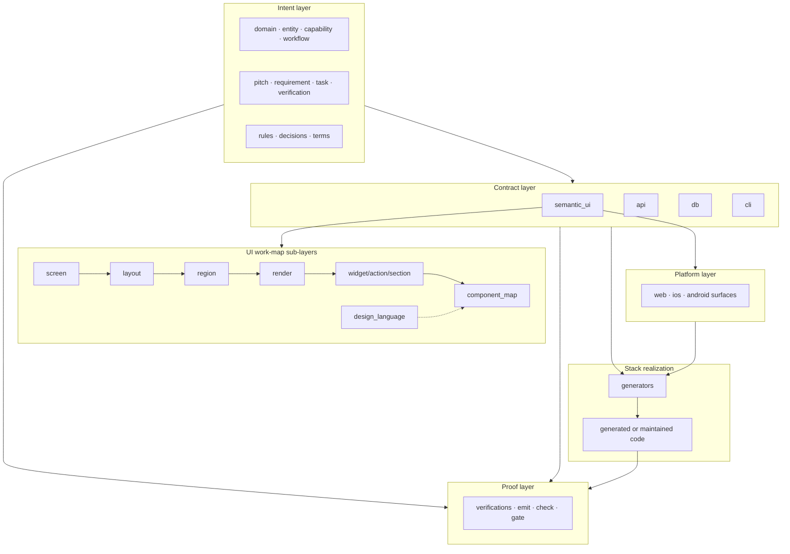
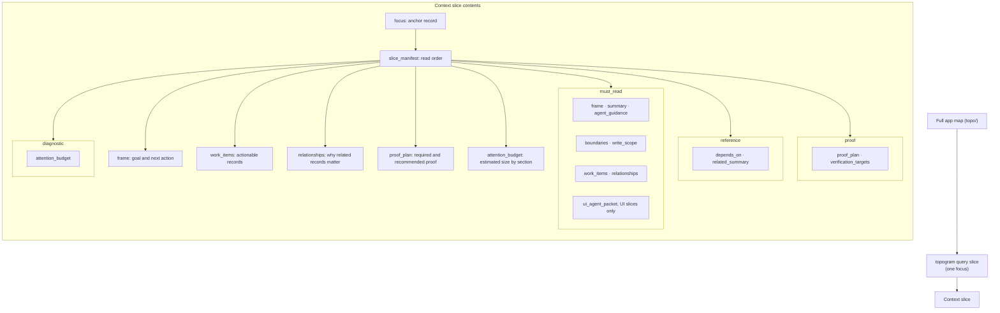
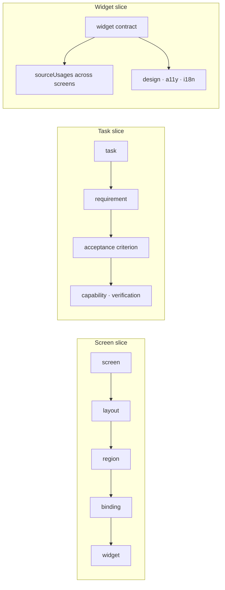
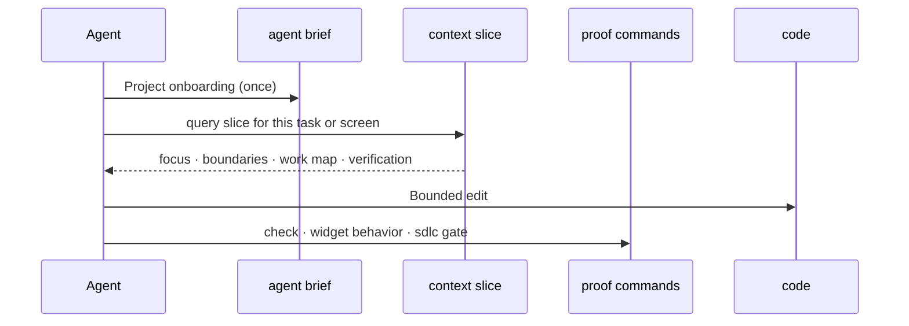

# Topogram Layers and Slices

> Model the app in layers; query slices when it is time to work.

Status: current
Audience: developers, agents, and technical writers evaluating Topogram
Use when: you need a short explanation of how the app map is structured and how context slices fit in.
Read time: ~2 minutes

Most teams ask humans and agents to change code in repos they only partly
understand. Topogram's answer is structural: keep a validated app map in
**layers**, then query **slices** for bounded context before anyone edits code.

## Layers: intent before implementation

Topogram separates **durable intent** from **stack realization**. The map
lives in `topo/`; generators and maintained apps realize it in framework code.



### What each layer owns

| Layer               | Records                                                         | Answers                                              |
| ------------------- | --------------------------------------------------------------- | ---------------------------------------------------- |
| Domain and behavior | `entity`, `capability`, `workflow`, `rule`, SDLC                | What the app means and how work is proven            |
| Contracts           | `semantic_ui`, `api`, `db`, `cli` surfaces                      | Typed intent without framework trees                 |
| UI work map         | `layout`, `region`, `render`, `widget`, `component_map` | Where product work belongs                           |
| Design              | `design_language`, token mappings, style intent                 | Semantic design scope, not CSS                       |
| Platform            | `web`, `ios`, `android`                                         | Routes and hints that inherit the shared UI contract |
| Stack realization   | generator output or maintained source                           | React, SvelteKit, Prisma, and so on                  |
| Proof               | `verification`, emit reports, gate commands                     | Whether a change is safe                             |

The UI graph is a **work map**, not a render tree:

```text
route → screen → layout → region → render → widget → component_map
```

Layouts say where work belongs. Widgets say what reusable semantic UI is needed.
Component maps say which platform components implement each widget. Concrete
surfaces inherit placement; they do not re-own it.

See [Topogram Model](/concepts/topogram-model/) and
[UI Work Map By Example](/design/ui-work-map-by-example/) for depth.

## Slices: bounded context for real work

A **context slice** is a focused packet cut from the full map, small enough
for one task, screen, widget, or capability:

```bash
topogram query slice ./topo --screen item_list --surface proj_web --detail compact
topogram query slice ./topo --task task_implement_audit_writer --mode implementation
topogram query slice ./topo --widget widget_data_grid
topogram query slice ./topo --task task_implement_audit_writer --format html
```

Each slice anchors on one record (`focus`) and pulls semantic closure around
it: dependencies, edit boundaries, verification targets, and proof commands.



### Slice tiers and detail levels

The `slice_manifest` labels sections so agents read what matters first:

| Tier       | Purpose                        | Examples                                    |
| ---------- | ------------------------------ | ------------------------------------------- |
| must_read  | Start here                     | focus, frame, summary, agent_guidance, work_items, relationships, write_scope |
| reference  | Drill down only if needed      | depends_on, related_summary                 |
| proof      | Run before finishing           | proof_plan, verification_targets            |
| diagnostic | Budget attention and debugging | attention_budget                            |

Use `--detail compact` for the smallest safe packet, `standard` for normal
work, and `full` when debugging the slice itself.

Use `--format html` when a human wants a static local cockpit with Start Here,
work items, relationship map, proof plan, write scope, glossary/rules, and
collapsible raw JSON.

### Slice types by focus



| Focus flag     | Question it answers                                      |
| -------------- | -------------------------------------------------------- |
| `--screen`     | What is on this page and where do I edit?                |
| `--widget`     | Where is this widget used and what must stay consistent? |
| `--task`       | What am I implementing and how do I prove done?          |
| `--capability` | What entities, rules, and surfaces does this touch?      |

UI slices include **`agent_readiness`**: ready, blocked, or ready with review,
plus change targets and proof commands.

## How layers and slices work together

|          | Layers                      | Slices                                  |
| -------- | --------------------------- | --------------------------------------- |
| What     | How the app is modeled      | What you query before editing           |
| Lives in | `topo/` (persistent source) | `query slice` output (ephemeral)        |
| Answers  | What is this app?           | What do I touch, and how do I prove it? |

Typical agent flow:



1. **`topogram agent brief`**: project-level onboarding.
2. **`topogram query slice`**: one focus per unit of work.
3. **`emit` / `check` / gate commands**: proof against the relevant layers.
4. **Generate or edit maintained code**: stack realization.

For UI tasks, stack slices:

```bash
topogram query slice ./topo --task <task-id> --mode implementation --json
topogram query slice ./topo --task <task-id> --mode implementation --format html
topogram query slice ./topo --screen item_list --surface proj_web --detail compact --json
topogram query sdlc-proof-gaps ./topo --task <task-id> --json
```

## Bottom line

Topogram is not a generator that happens to have specs. It is a **living app
map**: layers separate intent from implementation; slices give humans and
agents a smaller, verified surface to work from.

## Related

- [What Topogram Is](/concepts/what-is-topogram/)
- [Topogram Model](/concepts/topogram-model/)
- [Agent First Run](/agent-first-run/)
- [Generate vs Emit](/concepts/generate-vs-emit/)
- [Glossary](/concepts/glossary/): `term_work_map`, `term_context_slice`, `term_slice_manifest`
